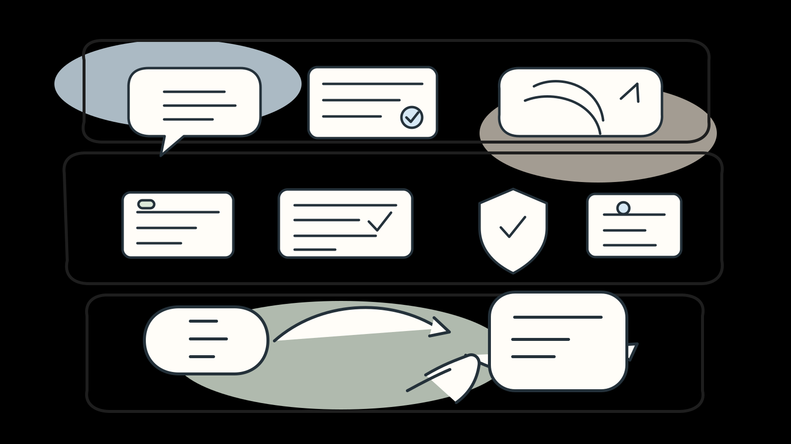
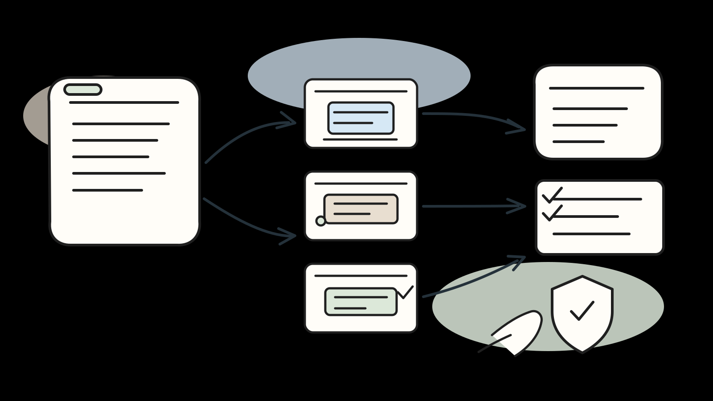
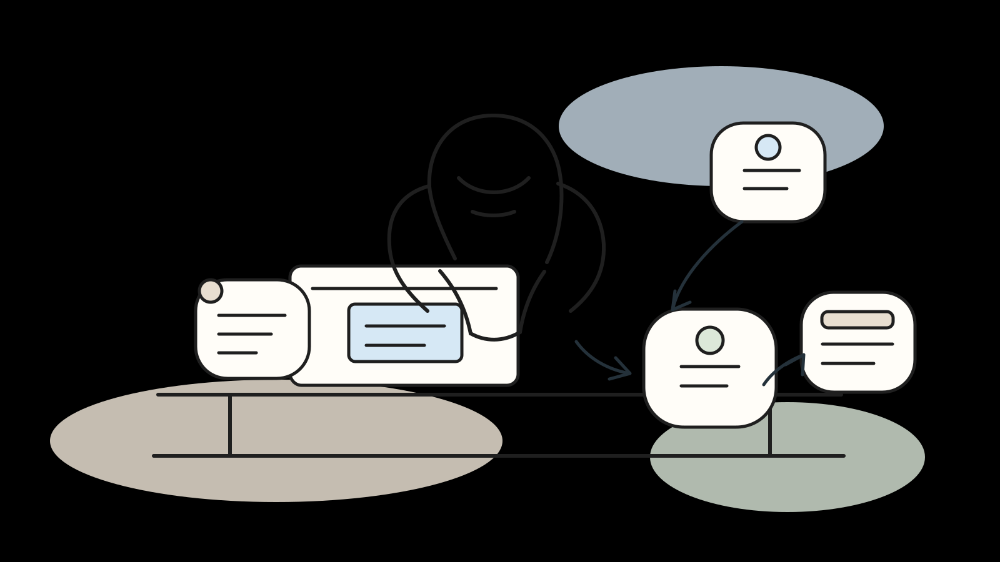

# Loop Engineering 公众号排版稿

## 标题备选

1. 别再只卷 Prompt 了，AI 下半场真正拼的是 Loop Engineering
2. Prompt 还重要，但真正拉开差距的，已经是 Loop Engineering
3. 为什么高手不再只研究提示词，而开始研究 Loop Engineering
4. AI 不是更会聊天了，而是开始学着把活做下去
5. 从 Prompt 到 Loop：AI 工具真正改变工作的地方，到底在哪

## 推荐标题

别再只卷 Prompt 了，AI 下半场真正拼的是 Loop Engineering

## 导语

过去两年，大家都在研究 prompt。

怎么写更准，怎么写更像咒语，怎么让模型“一次就懂”。

但现在，很多真正把 AI 用进工作流的人，关注点已经变了。

他们不再只问“这句话怎么写”，而开始问一个更现实的问题：

这件事，能不能交给 AI 自己往下做？

做到哪一步该停，出了错怎么办，什么时候必须叫人回来拍板。

这就是最近越来越多人开始谈的东西：`Loop Engineering`。

---

## 正文

这两年聊 AI，最容易聊偏的一件事，就是大家总把注意力放在 prompt 上。

仿佛只要提示词写得够巧，模型就会突然开窍，工作也会自动完成。

这想法不能说错，但确实只说对了一半。

因为模型能力已经变了。

它不只是会回答问题。它会读文档、会搜代码、会调工具、会写文件、会跑命令、会补测试，甚至还能把任务拆开，分给不同 agent 去做。

能力一变，工作方式就会跟着变。

所以现在更关键的问题，已经不是“这句话怎么问”，而是：

这件事，能不能交给 AI 连续做下去？

说得更直接一点，loop engineering 研究的不是提问技巧，而是怎么把一份工作设计成一个闭环。

这个闭环里，AI 不是只回你一句话，而是会按步骤往前推进：先理解任务，再看上下文，再动手，再验证，再修正，最后把结果交回来。

这就是它和 prompt engineering 的根本区别。

`Prompt Engineering` 更像单轮沟通。  
`Loop Engineering` 更像流程编排。

前者在意的是一句话怎么写。  
后者在意的是整件事怎么跑。

*图 1：从 prompt 到 harness 再到 loop，它们不是一个层面的东西。*

很多人到这里会再问一句：那 `harness` 又是什么？

我更愿意把这三个词拆成三层来看。

第一层是 `prompt`。

它负责沟通。你要把目标、约束、输出格式说清楚。没有这一层，模型连方向都抓不住。

第二层是 `harness`。

这个词经常容易被说得很玄，其实它更像模型外面那层执行骨架。工具调用、权限控制、沙箱、日志、测试、规则文件、检查点、回滚能力，这些基本都算 harness 的一部分。

没有 harness，模型顶多会说。

有了 harness，它才算有手有脚，也有护栏。

第三层才是 `loop`。

它负责把整件事串起来：什么时候先侦察，什么时候执行，什么时候验证，什么时候停，什么时候交给别的 agent，什么时候必须把决定还给人。

所以这三者不是对立关系，也不是谁取代谁。

它们更像一套分层配合。

- prompt 负责把话说清楚
- harness 负责让系统跑起来，而且别乱跑
- loop 负责把任务真正变成一个闭环

如果你只有 prompt，没有 loop，那更像聊天。  
如果你有 harness，没有 loop，那只是工具箱。  
如果你硬做一个 loop，但 prompt 和 harness 都很弱，结果通常也不会稳定。

真正好用的 agent 工作流，三层都得有。

这个时候，讲概念其实已经差不多了。更有用的是看一个具体例子。

拿一个很常见的开发任务来说：给一个现有 SaaS 项目接入 GitHub OAuth 登录。

这件事不算大，但也绝对不是一句“帮我加个登录”就能稳稳做完的。

它至少会牵涉后端鉴权、前端入口、环境变量、回调地址、异常处理、测试，还有最后的人类 review。

如果只用 prompt，很多人的起手式会很简单：

“帮我加 GitHub OAuth 登录。”

模型当然能开始干。

但问题也马上来了。

它不知道你项目里有没有现成鉴权层，不知道测试怎么跑，不知道环境变量从哪注入，也不知道哪些目录不能动。

这就是为什么，loop engineering 的第一步，往往不是改代码，而是先把长期上下文固定下来。

在 `Codex` 里，你可以通过仓库里的 `AGENTS.md` 告诉它怎么理解代码库、该跑什么测试、遵守什么项目约定。OpenAI 官方介绍里也提到，Codex 的任务会在独立环境里执行，能读写文件，也能跑测试和命令。

在 `Claude Code` 里，这一层通常落在 `CLAUDE.md`。Anthropic 官方文档建议把代码风格、测试命令和工作流规则写进去。它还区分了 `CLAUDE.md` 这种建议性上下文，和 `hooks` 这种必须执行的确定性动作。

在 `Cursor` 里，这层更直接。`.cursor/rules`、`AGENTS.md`、skills、subagents 这些机制，本质上都在帮你做一件事：把默认规则提前塞进系统，而不是每次重新解释一遍。

比如你完全可以先写清楚：

- 优先复用现有 auth 模块
- 不要碰 `migrations/`
- 只跑和改动相关的测试
- UI 文案沿用现有登录页语气
- 提交前必须跑 typecheck

这一步看起来不起眼，实际上特别关键。

因为你不是在“多写一点提示词”，你是在给后面的每一轮执行省力。

接下来才是 loop 的第二步：先侦察，不急着写。

一个稳定的 loop，通常不会上来就改代码。

它会先让 agent 看清局面：项目里有没有现成鉴权中间件？OAuth 工具是否已经接过？前端登录页在哪？环境变量从哪里走？测试是 Jest、Vitest 还是 Playwright？

这一步特别适合拆给独立 agent。

在 `Claude Code` 里，官方文档很明确地建议用 `subagent` 去做代码探索和独立复查。

在 `Cursor` 里，subagent 也能用独立上下文去跑，甚至可以后台执行，不把主线程塞满。

在 `Codex` 里，思路也差不多，只不过它更像把侦察任务本身当成独立任务派出去，跑完再把日志和测试证据带回来。

所以一个更像样的 GitHub OAuth loop，通常不会是“直接做”，而是先分出发现阶段：

- 一个 agent 查现有 auth 结构
- 一个 agent 查前端登录入口和 UI 复用点
- 一个 agent 查测试和环境配置

先把地图画出来，再开始施工。

*图 2：一个像样的 loop，不是让一个 agent 一路闷头干，而是先侦察、再分工、再验证。*

第三步才是执行，而且执行也不该只靠一个 agent 闷头干到底。

比如这个任务，完全可以拆成三段：

- 一个 agent 只管后端登录流和回调
- 一个 agent 只管前端入口和错误提示
- 一个 agent 只管补测试和检查回归风险

你会发现，loop engineering 真正改变的，不是“AI 更聪明了”，而是你的任务不再只有一条单线程。

以前你更像在聊天框里来回拉扯。

现在你开始像在调度一个小团队。

当然，最容易被忽略，也是最重要的一步，还是验证。

这一步不能省。

很多人一说 agent，就容易想象成“它自己做完，我来收货”。

实际不是。一个没验证环节的 loop，很容易稳定地产出错结果，而且错得很勤快。

这时候 harness 的价值就体现出来了。

`Codex` 会给出终端日志和测试输出，方便你核验它到底做了什么。  
`Claude Code` 有 checkpoints，可以在试错后回退，也可以再起一个 subagent 做独立复查。  
`Cursor` 除了 checkpoints，还有 `Bugbot` 这种针对 PR diff 的审查流，必要时还能继续拉起 cloud agent 去修。

一个完整的 loop，到这里至少应该回答清楚几件事：

- 功能测试过没过
- 类型检查过没过
- 有没有超出任务范围的改动
- 有没有安全和边界问题
- 有没有必须由人类拍板的地方

注意，这不是对 AI 不信任。

恰恰相反。

正因为你开始把它当成真的执行者了，它才更应该进正式流程，而不是停留在“感觉差不多就行”。

说到这里，很多人其实会有点紧张。

是不是以后不会写 prompt 的人就掉队了？  
是不是以后不会带 agent 的人就很危险？  
是不是 AI 工作流一升级，普通人就更难跟上了？

我觉得没必要先把自己吓到。

因为 loop engineering 真正改变的，不是“人没用了”，而是“人做的那层事情变了”。

以前你可能更像操作员，一句一句盯着改。  
以后你更像负责人，决定目标、约束、节奏、验收和风险边界。

*图 3：人没有退场，只是从逐步操作，变成了设计流程和守住边界的人。*

这其实不是一件坏事。

团队里真正稀缺的能力，从来都不只是写出一段代码，或者写出一句漂亮 prompt。

真正稀缺的，是这些东西：

- 什么问题值得做
- 怎么拆才不会失控
- 哪些地方能自动化
- 哪些地方必须人工接管
- 什么时候该继续跑
- 什么时候必须踩刹车

这些能力，本来就是人的长项。

所以别把 `Loop Engineering` 理解成一个必须立刻掌握的新名词，更别把它当成一种新的焦虑来源。

它更像是把你原本就熟悉的工程习惯，重新装回 AI 工作流里。

你以前会写规则、会分任务、会做 review、会设测试门槛。现在只是多了一个执行者，而这个执行者需要你把流程讲清楚。

说到底，变化不是“会不会提问”。

而是你能不能把一件工作说清楚、拆清楚、盯清楚、收清楚。

prompt 当然还重要。  
harness 当然也重要。  
但真正让 AI 开始像同事，而不是像聊天机器人，靠的是 loop。

这才是下半场。

## 结尾金句

我们真正需要的，不是一个更会说话的 AI，而是一个真的能把事情做下去的系统。

## 参考链接

- [OpenAI：Introducing Codex](https://openai.com/index/introducing-codex/)
- [Claude Code 官方文档](https://code.claude.com/docs/en/best-practices)
- [Cursor Rules 官方文档](https://cursor.com/docs/rules.md)
- [Cursor Subagents 官方文档](https://cursor.com/docs/subagents.md)
- [Cursor Bugbot 官方文档](https://cursor.com/docs/bugbot.md)
