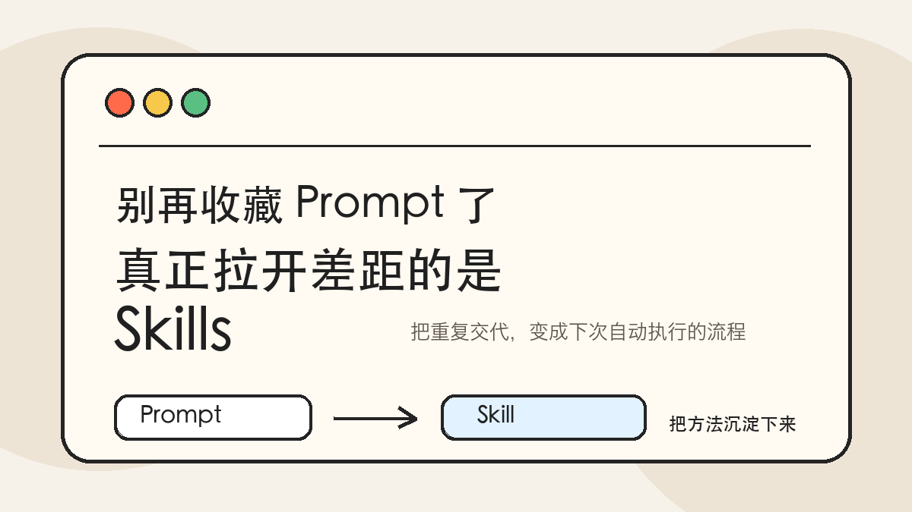
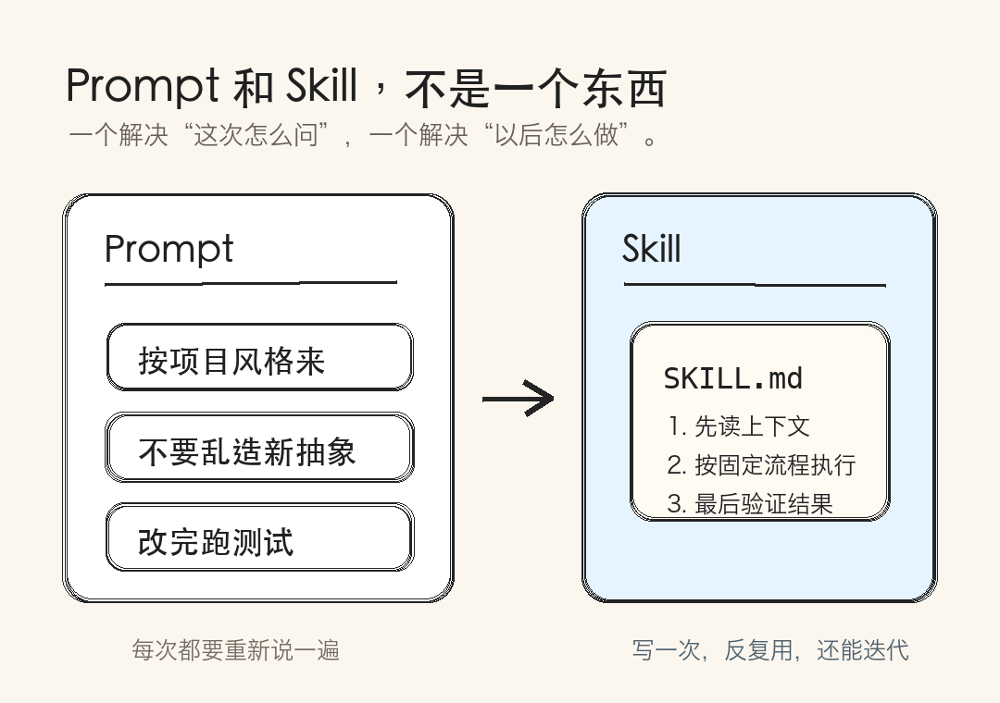
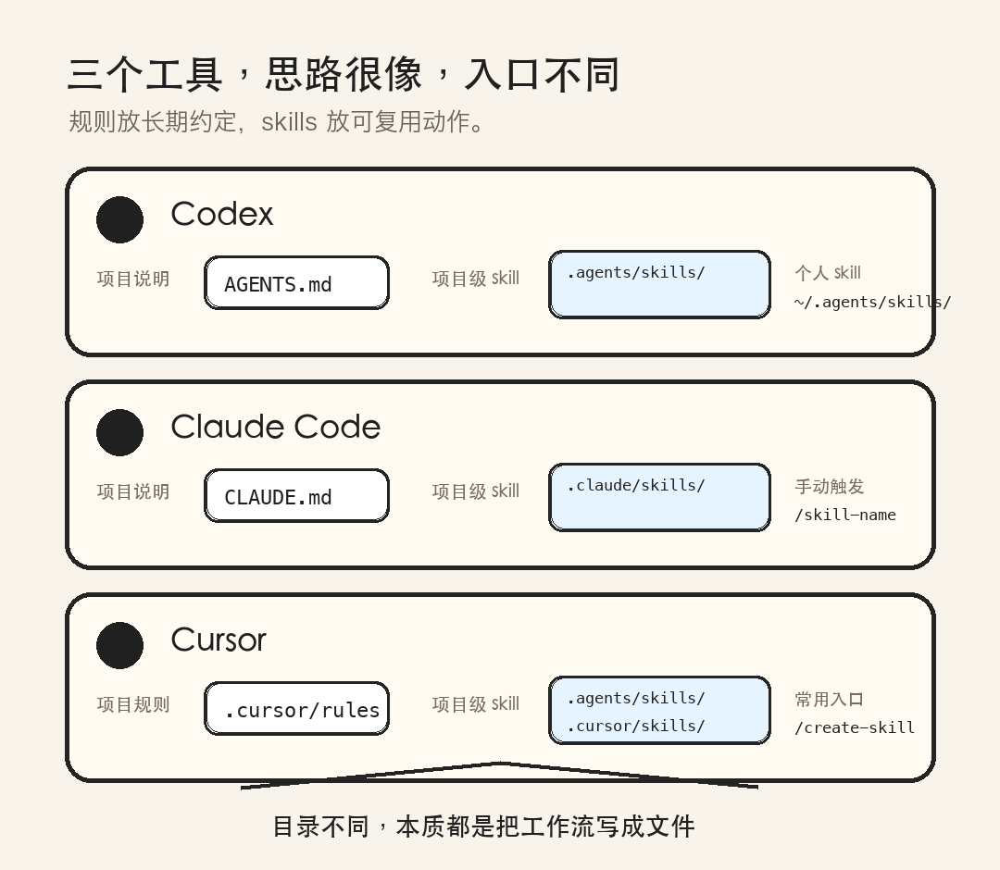
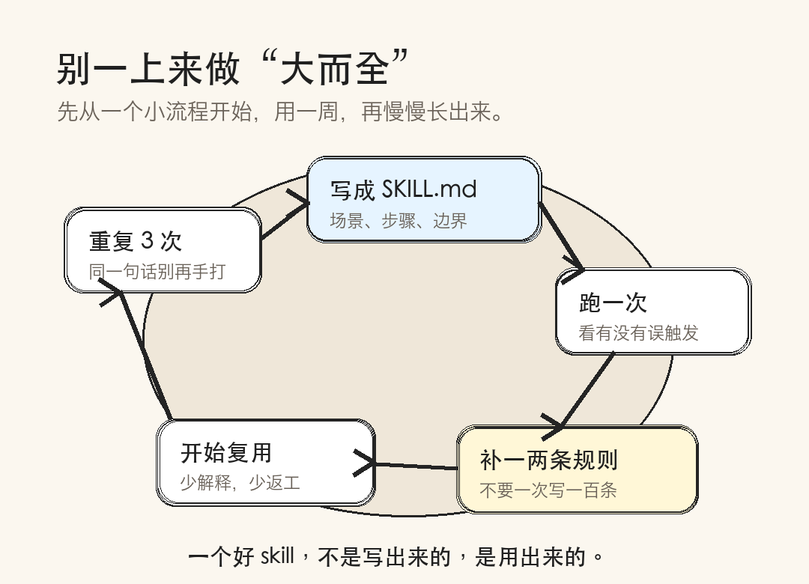

# 用 Skills 把 AI 变成顺手的工作流：以 Codex、Claude Code、Cursor 为例

很多人刚开始用 AI 编程工具时，最容易把精力花在 prompt 上。

这当然没错。

一个清楚的 prompt，仍然是好结果的起点。

但如果你每天都在重复同一类请求，比如“按我们项目规范写组件”“先查原因再修 bug”“改完必须跑测试”“把这篇文章整理成公众号格式”，问题就不再是某一句 prompt 写得够不够漂亮。

问题变成了：

这些重复的工作规则，为什么还要每天重新说一遍？

这就是 skills 值得认真对待的地方。

它不是一个更高级的提示词小抄，而是把你反复使用的工作方法，封装成一个可以被 AI 自动调用、团队共享、版本管理的能力包。

如果说 prompt 是“这次我想让你做什么”，那么 skill 更像是“以后遇到这类事，都按这个方法做”。

截至 2026-07-05，Codex、Claude Code、Cursor 都已经把这类能力做进了自己的工作流里，只是命名、目录和触发机制略有差异。

这篇文章就用这三个工具做例子，讲清楚一件事：

如何创建 skills，让 AI 不只是回答问题，而是真的提高你的工作效率。



---

## 一、先分清：规则、记忆、Skill 不是一回事

在正式创建之前，先把几个概念拆开。

很多人会把 `AGENTS.md`、`CLAUDE.md`、`.cursor/rules`、skills 混在一起用。短期看问题不大，长期看就容易变成一团上下文毛线球。

一个更实用的区分是：

`规则文件` 负责长期约束。

比如项目技术栈、代码风格、测试命令、哪些目录不能动、提交前需要做什么检查。

Codex 官方文档里，`AGENTS.md` 就是给 Codex 的项目说明文件。Codex 会在开始工作前读取这些文件，并把全局规则和项目规则叠加起来。Cursor 也支持 `AGENTS.md`，同时还有 `.cursor/rules` 这种更结构化的规则系统。Claude Code 对应的常见文件则是 `CLAUDE.md`。

`记忆` 负责积累事实。

比如“这个项目用 pnpm”“本地服务要先启动数据库”“上次某个测试失败是因为环境变量没设”。记忆可以帮 AI 少走回头路，但它不一定适合承载复杂流程。

`skill` 负责可重复执行的方法。

比如：

- 审查 PR
- 生成发布说明
- 给 React 组件补可访问性检查
- 把长文改成公众号排版稿
- 按固定流程调查线上错误
- 按公司模板生成周报

判断一个内容该不该做成 skill，有一个很简单的标准：

如果你已经把同一段要求复制粘贴了三次，它就有资格变成 skill。

如果这段要求还带步骤、模板、检查清单、脚本或参考资料，那它就更应该变成 skill。

---

## 二、Skill 到底长什么样

不同工具的目录略有差异，但核心结构很接近。

一个典型 skill 通常是一个文件夹，里面至少有一个 `SKILL.md`：

```text
my-skill/
  SKILL.md
  scripts/
  references/
  assets/
```

`SKILL.md` 是入口。

它一般包含两部分：

第一部分是 frontmatter，也就是文件开头的 YAML 元数据。这里写 skill 的名字、描述、触发条件、是否允许模型自动调用等。

第二部分是正文。这里写 AI 真正要遵守的步骤、判断标准、输出格式、验收方式。

例如一个非常简单的“变更摘要”skill 可以这样写：

```markdown
---
name: summarize-changes
description: Summarize current code changes and identify risks before commit.
---

## Instructions

1. Inspect the current git diff.
2. Summarize the change in 2-3 concise bullets.
3. List possible risks, missing tests, and files that deserve extra review.
4. If there is no diff, say there are no uncommitted changes.
```

这已经比临时 prompt 稳定很多。

但真正有用的 skill，通常不只是“提醒 AI 做什么”，而是把完整工作流写出来。

比如一个“公众号文章整理”skill，可以规定：

- 默认使用简体中文
- 段落要适合手机阅读
- 必须输出标题备选、推荐标题、导语、正文、金句
- 事实性内容必须列参考来源
- 图片必须放进当前文章包的 `images/` 目录
- 不要把草稿散落在仓库根目录

你会发现，这些规则不难。

难的是每次都记得说。

skill 的价值就在这里：它把“每次都要记得说”变成“工具自己会想起来”。



---

## 三、在 Codex 里创建 Skill：把工作流放进 `.agents/skills` 或个人 skills 目录

Codex 的 skills 遵循一种渐进式加载思路。

官方文档说得很清楚：Codex 起初只看到每个 skill 的名称、描述和路径；只有当它判断某个 skill 相关时，才会读取完整的 `SKILL.md`。这意味着你可以把较长的流程、参考资料和脚本放进 skill 目录，而不是一开始就把所有内容塞进上下文。

这点很重要。

因为 AI 工具的上下文不是无限的。长期规则适合短，skill 适合把“需要时才加载”的细节收起来。

在 Codex 里，项目级 skill 通常放在 `.agents/skills/`，个人常用 skill 通常放在 `~/.agents/skills/`。一个基础 skill 可以长这样：

```text
.agents/
  skills/
    article-wechat-ready/
      SKILL.md
      references/
        style-guide.md
```

`SKILL.md` 可以这样写：

```markdown
---
name: article-wechat-ready
description: Use when turning a draft into a WeChat public-account article package.
---

## Workflow

1. Read the current article draft and any notes in the package.
2. Produce title options, a recommended title, short lead-in, body copy, closing quote, and references.
3. Keep paragraphs short for mobile reading.
4. Use Simplified Chinese unless the user asks otherwise.
5. Keep all article files inside the article package folder.

## Output files

- full-article.md
- summary.md
- wechat-ready.md
```

如果这类工作只属于当前项目，就放在项目里。

如果你希望所有项目都能用，就放在用户级目录。

更实用的做法是把规则分层：

- `AGENTS.md` 写项目常识，比如目录结构、命名规则、测试要求。
- skill 写具体工作流，比如“怎么写公众号稿”“怎么做代码审查”“怎么发布版本”。
- scripts 写可执行动作，比如格式检查、截图、导出 PDF、生成目录。

这样 Codex 不是每次从零开始理解你的偏好，而是先读项目说明，再按任务调用相应 skill。

换句话说，你不是在训练模型。

你是在训练你的工作现场。

---

## 四、在 Claude Code 里创建 Skill：把反复粘贴的步骤变成 `/skill-name`

Claude Code 对 skills 的解释很直接：当你总是在聊天里粘贴同一套说明、清单或多步骤流程时，就应该创建 skill。

它的一个特点是，你既可以让 Claude 自动判断什么时候使用 skill，也可以通过 `/skill-name` 手动调用。

项目级 skill 常见位置是：

```text
.claude/
  skills/
    review-pr/
      SKILL.md
```

个人级 skill 则通常放在：

```text
~/.claude/skills/
```

一个“上线前检查”的 skill 可以这样写：

```markdown
---
description: Run a pre-release checklist before deploying or merging important changes.
disable-model-invocation: true
---

## Pre-release checklist

1. Summarize what changed.
2. Identify files with risky behavior changes.
3. Run the project's standard tests.
4. Check whether documentation or release notes need updates.
5. Report blockers separately from nice-to-have improvements.
```

这里的 `disable-model-invocation: true` 很有用。

它表示这个 skill 只在你手动调用时启用，不让 Claude 自己决定。对于发布、部署、删除、迁移这类高风险动作，这种设计更稳。

Claude Code 还支持更进一步的模式。

比如它的 skill 可以带 `scripts/`、`references/`、`assets/`；可以通过 frontmatter 控制工具权限；也可以在某些场景下让 skill 跑在子 agent 里。

这让 skill 不只是“提示词模板”，而更像一种轻量的自动化接口。

举个例子，如果团队里经常要做事故复盘，可以写一个 `incident-review` skill：

```text
.claude/
  skills/
    incident-review/
      SKILL.md
      references/
        postmortem-template.md
```

`SKILL.md` 里不必塞完整模板，只需要写：

```markdown
---
description: Create an incident review from logs, timeline notes, and team findings.
---

## Instructions

1. Gather the timeline from provided notes or logs.
2. Separate facts from guesses.
3. Use `references/postmortem-template.md` for structure.
4. Identify customer impact, root cause, contributing factors, and follow-up actions.
5. Do not invent missing timestamps. Mark unknowns explicitly.
```

这类 skill 一旦稳定下来，团队里的新人也能马上复用。

它沉淀的不是某个人的 prompt 技巧，而是团队的工作方法。

---

## 五、在 Cursor 里创建 Skill：从 Rules 走向可执行工作流

Cursor 过去很多工作习惯都围绕 Rules 展开。

Rules 很适合放项目约定。

比如：

- 所有 API 输入必须用 zod 校验
- React 组件必须使用命名导出
- migration 必须有 `up` 和 `down`
- 某个目录下的文件必须遵守特定架构

Cursor 的规则系统支持 `.cursor/rules`，也支持 `AGENTS.md`。根据官方文档，`.cursor/rules` 里的项目规则可以按“总是应用”“智能应用”“按文件匹配”“手动 @ 提及”等方式触发。

但当规则从“约束”变成“流程”时，就该考虑 skill。

Cursor 的 skills 文档里提到，skills 是一种开放标准，用来给 agent 扩展专业能力；它可以包含脚本、模板和参考资料，并且会按需加载。

Cursor 会从这些位置自动发现 skills：

```text
.agents/skills/
.cursor/skills/
~/.agents/skills/
~/.cursor/skills/
```

它还兼容 Claude 和 Codex 的一些 skills 目录，例如 `.claude/skills/`、`.codex/skills/`、`~/.claude/skills/`、`~/.codex/skills/`。

这件事很值得注意。

因为它说明 skills 正在变成跨工具的工作流资产。

你今天为 Cursor 写的某些 skill，明天可能也能被其他支持 Agent Skills 标准的工具读懂。



一个 Cursor skill 的基础结构可以是：

```text
.cursor/
  skills/
    react-accessibility-pass/
      SKILL.md
```

`SKILL.md`：

```markdown
---
name: react-accessibility-pass
description: Review and improve React components for accessibility. Use when editing UI components or when the user asks for accessibility improvements.
paths:
  - "**/*.tsx"
  - "**/*.jsx"
---

## Instructions

1. Inspect the component and related styles.
2. Check labels, keyboard access, focus states, semantic elements, and ARIA usage.
3. Prefer native HTML behavior before adding ARIA.
4. Keep visual changes consistent with the existing design system.
5. Report any issues that require product decisions instead of guessing.
```

这里的 `paths` 很关键。

它让 skill 只在相关文件出现时被暴露给 agent，避免所有任务都背着一堆无关规则。

这也是创建 skills 时很容易忽略的一点：

不是写得越多越好，而是触发得越准越好。

---

## 六、一个好 Skill 应该包含什么

我建议把 skill 当作一份“工作合同”来写。

它不需要长，但要清楚回答七个问题。

第一，这个 skill 什么时候用？

写在 `description` 里，而且要具体。

不要写：

```text
Helps with development.
```

这等于没写。

应该写：

```text
Use when adding a new API endpoint in this repository, including validation, error handling, tests, and documentation updates.
```

第二，它不应该什么时候用？

很多 skill 失控，不是因为写得太少，而是触发范围太宽。

如果只适用于后端，就加路径限制。

如果只应该手动执行，就禁用自动调用。

如果涉及发布、迁移、删除、付费操作，就明确要求先让人确认。

第三，它要按什么步骤做？

步骤要像清单，不要像散文。

比如：

```markdown
1. Read existing examples before creating new patterns.
2. Make the smallest change that satisfies the request.
3. Run the relevant test command.
4. Report changed files and verification results.
```

第四，它要产出什么格式？

AI 最怕“你看着办”。

如果你要 PR review，就规定输出：

- 发现的问题
- 风险等级
- 文件和行号
- 建议修法
- 未验证的地方

如果你要公众号文章，就规定输出：

- 标题备选
- 推荐标题
- 导语
- 正文
- 金句
- 参考资料

第五，它有哪些参考资料？

不要把长篇规范全塞进 `SKILL.md`。

更好的做法是放到 `references/` 里，然后在 `SKILL.md` 里告诉 agent 什么时候读取。

例如：

```text
references/
  api-style-guide.md
  release-note-template.md
  brand-voice.md
```

第六，哪些动作可以自动做？

比如读文件、跑测试、生成摘要，通常可以自动。

但发布、删除、迁移、发送邮件、改生产配置，就要谨慎。

skill 里最好写清楚：

```markdown
Before running deployment, summarize the target environment and ask for explicit approval.
```

第七，怎么验证完成？

没有验证的 skill，只是更长的 prompt。

有验证的 skill，才是工作流。

验证可以是：

- 测试命令
- lint
- typecheck
- 截图
- diff review
- 链接检查
- 人工确认点

真正提升效率的不是“AI 一次写得更快”，而是“AI 做完以后更少返工”。

---

## 七、从一个小 Skill 开始：不要一上来建设知识库帝国

很多人第一次做 skills，会犯一个很自然的错误：

想把所有规则都写进去。

项目结构、业务背景、代码风格、测试命令、部署流程、设计规范、文案语气、排查手册，全都塞进一个巨大的 `SKILL.md`。

这通常会失败。

因为 skill 不是公司的知识库，也不是给 AI 的百科全书。

skill 最适合的是“可重复的动作”。

最好的起点，是选一个你本周已经重复做过三次的小流程。

比如：

- 每次提交前总结 diff
- 每次改 UI 后检查可访问性
- 每次修 bug 先写复现路径
- 每次写文章都整理成公众号格式
- 每次发布前跑固定 checklist

先写一个 30 行以内的 skill。

用一周。

观察它哪里误触发、哪里说得不清楚、哪里还要你反复补充。

然后再迭代。

skills 的维护方式，很像维护测试用例。

不是一次写完就供起来，而是在每次出错后补一条更具体的约束。

比如 AI 总是忘记跑测试，就加：

```markdown
Always report the exact verification command and result. If verification was not run, explain why.
```

如果 AI 总是乱新建抽象，就加：

```markdown
Prefer existing project patterns. Add a new abstraction only when it removes repeated complexity in at least two places.
```

如果 AI 总是写得太像说明书，就加：

```markdown
For user-facing Chinese copy, use short paragraphs and natural spoken rhythm. Avoid slogan-like phrasing.
```

每次只补一两条。

慢慢地，你会得到一套非常贴合自己的工作流。



---

## 八、三类最值得先做的 Skill

如果你不知道从哪里开始，可以先做这三类。

第一类：检查型 skill。

比如代码审查、文章润色、发布前检查、SEO 检查、可访问性检查。

这类 skill 风险低，收益高，而且很容易验证。

第二类：转换型 skill。

比如把会议纪要转成 action items，把长文转成公众号稿，把 PR diff 转成 changelog，把产品需求转成测试用例。

这类工作经常重复，而且格式稳定，非常适合 skills。

第三类：排查型 skill。

比如线上错误排查、性能问题分析、测试失败定位。

这类 skill 要写得更谨慎：先读、先复现、先列假设，再动手修。不要让 AI 上来就改。

一个排查型 skill 可以这样开头：

```markdown
## Debugging protocol

1. Reproduce or locate the failure before changing code.
2. List the top 2-3 hypotheses.
3. Gather evidence for the most likely hypothesis.
4. Make one minimal fix.
5. Run the failing test again.
6. Report what changed and what remains uncertain.
```

这短短几行，往往比“帮我修一下”稳定得多。

因为它改变了 AI 的工作姿势。

---

## 九、真正的效率，不是少打几个字

很多人理解 skills，会先想到“省 prompt”。

这当然是收益之一，但不是最大的收益。

真正的收益有三个。

第一，减少重复解释。

你不用每次告诉 AI：“我们项目是这样组织的”“我们文章要这样排版”“我们发布前要这样检查”。

第二，减少随机发挥。

没有 skill 时，AI 会根据当前对话临场发挥。发挥好了很惊艳，发挥偏了也很麻烦。

有 skill 后，它至少有一条稳定路径。

第三，沉淀团队方法。

一个优秀员工的工作习惯，过去常常只存在于脑子里。

现在它可以变成一个可读、可改、可版本管理的 skill。

这件事的意义很大。

因为 AI 工具越强，人越不应该只做“指令输入员”。

更重要的能力会变成：

你能不能把自己的工作方法说清楚？

你能不能把隐性经验变成显性流程？

你能不能设计一个让 AI 稳定发挥的工作环境？

这就是 skills 真正提高效率的地方。

它不是让你偷懒。

它是逼你把工作方法整理到足够清楚。

整理清楚以后，不只是 AI 受益，人也受益。

---

## 十、一个可以直接套用的 Skill 模板

最后给一个通用模板。

不管你用 Codex、Claude Code，还是 Cursor，都可以从这个结构改起：

```markdown
---
name: your-skill-name
description: Use when [具体任务场景]. Do not use for [不适用场景].
---

# Your Skill Name

## Goal

Describe the outcome this skill should produce.

## When to Use

- Use when...
- Use when...

## Before Acting

1. Read the relevant files or context.
2. Identify constraints, risks, and unknowns.
3. Ask the user only if a decision cannot be safely inferred.

## Workflow

1. Step one.
2. Step two.
3. Step three.

## Output Format

- Summary:
- Changes made:
- Verification:
- Open questions:

## Guardrails

- Do not make unrelated changes.
- Do not invent facts.
- Do not run high-risk actions without explicit approval.
- Prefer existing project patterns.

## Verification

- Run the relevant check if available.
- If verification cannot be run, explain the reason.
- Report exact command names and results.
```

你可以先把它改成一个“文章整理”skill，也可以改成“PR review”skill、“bug 排查”skill、“发布检查”skill。

重点不是模板本身。

重点是你开始把工作中那些反复出现的隐性规则，一点点写成 AI 能执行的流程。

到那一步，AI 工具就不再只是一个聊天窗口。

它会更像你工作台上的一组固定工具。

每个工具都有自己的用途、边界和检查方式。

你要做的，不是每天临时发明一把新螺丝刀。

而是把真正顺手的那几把，打磨出来，放在伸手就能够到的地方。

---

## 参考资料

1. OpenAI Developers, Codex: Agent Skills, https://developers.openai.com/codex/skills
2. OpenAI Developers, Codex: Custom instructions with AGENTS.md, https://developers.openai.com/codex/guides/agents-md
3. Anthropic, Claude Code Docs: Overview, https://code.claude.com/docs/en/overview
4. Anthropic, Claude Code Docs: Extend Claude with skills, https://code.claude.com/docs/en/skills
5. Cursor Docs: Agent Skills, https://cursor.com/docs/skills.md
6. Cursor Docs: Rules, https://cursor.com/docs/rules.md
