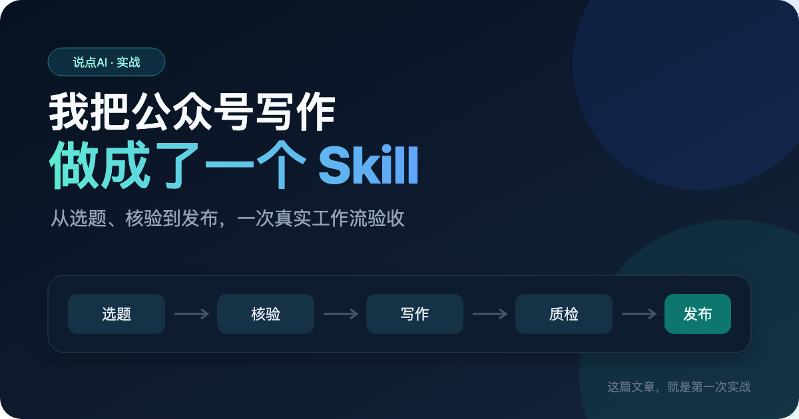
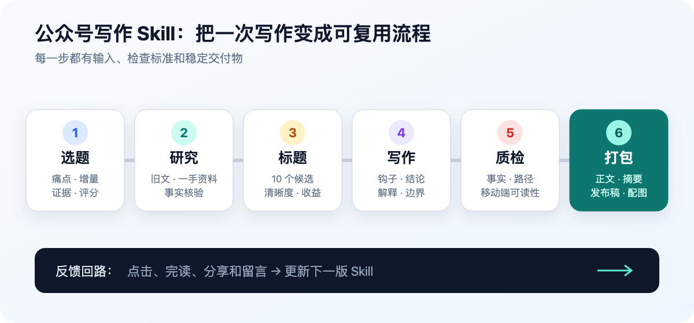
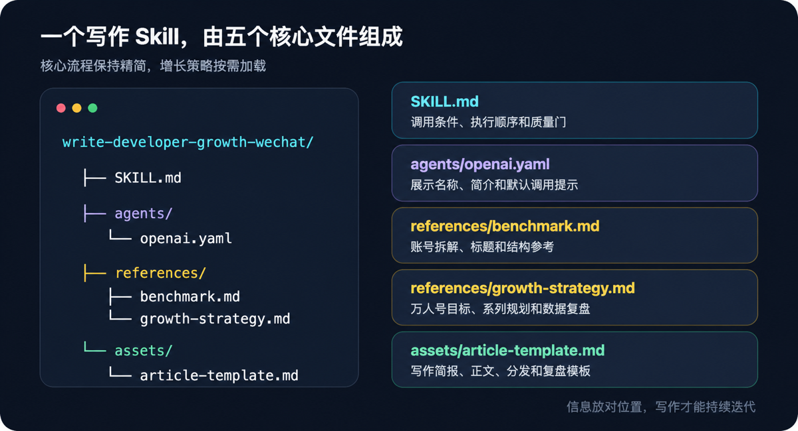
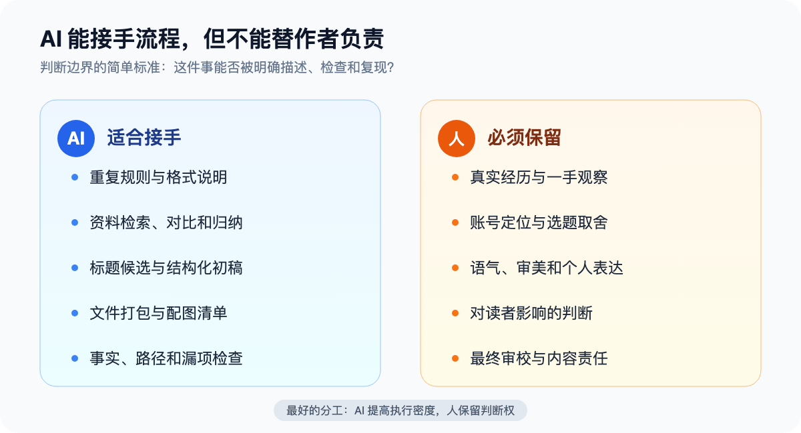

# 发布信息

## 推荐标题

我把公众号写作做成了一个 Skill，第一次验收就没通过

## 备选标题

1. 我把公众号写作做成了一个 Skill，第一次验收就没通过
2. 我用 Codex 做了一个公众号写作 Skill，它先否掉了自己的第一稿
3. 写了两篇公众号之后，我决定不再每天给 AI 办入职
4. 一篇 2607 字的初稿，让我重新改了公众号写作 Skill
5. 公众号写作最耗时间的，可能根本不是写字
6. 从选题到复盘，我把公众号写作变成了一套可执行流程
7. AI 能不能替你写公众号？我的第一次验收结果并不完美
8. 我给 AI 写了一份公众号工作说明书，然后让它检查自己
9. 一个写作 Skill，为什么必须允许第一稿不通过
10. 想让 AI 稳定写技术文章，先别急着写更长的 Prompt

## 封面



## 导语

我把选题、核验、写作、配图和质检做成了一个 Codex Skill。第一次运行看起来很顺利：文件齐全，图片也生成了。可按新版标准验收后，它发现自己的第一稿只有 2607 个汉字，目录已经过时，标题承诺的“完整实战”也缺少证据。这篇文章记录的，正是它第一次没通过验收之后发生的事。

---

第一版文章写完时，文件齐了，图也配了，读起来似乎没什么大问题。

然后我让刚做好的公众号写作 Skill 检查了一遍。

结果很直接：微信发布稿只有 2607 个汉字；正文宣称的「真实目录」已经过时；标题说是「完整实战」，文中却没有足够的前后对比；结尾也没说清楚下一篇要做什么。

所以，你现在看到的并不是它写出的第一稿，而是第一稿没通过验收之后的第二版。

这次经历也让我确定了一件事：写作 Skill 最有用的地方，不是帮你快速生成几千字，而是把你每次都会忘记的标准，固定在流程里。

## 写了两篇之后，我发现最累的不是写字

我最近开始认真运营公众号「说点AI」，主要写给正在使用 AI 编程工具、Agent 和自动化工作流的开发者。

前两篇文章写下来，我发现真正消耗时间的，往往是一串重复决策：

- 这个选题值不值得写？
- 它和上一篇有没有重复？
- 标题应该讲概念，还是直接给结果？
- 哪些信息必须查官方文档？
- 文章要放哪些截图、代码或输出？
- 发布前还缺摘要、配图还是排版稿？

句子可以让 AI 帮忙整理，这些决策却不会自动消失。

如果每次都从零解释，就像请了一个助手，却每天都要重新给他办入职。

我想把这些稳定的判断写下来，让 Codex 每次开始写作前，都先按同一套流程工作。



## Skill 和一条更长的 Prompt 有什么不同

一条 Prompt 通常处理当前这次任务。

比如：

> 帮我写一篇面向程序员的公众号文章，语气自然一点，标题要有吸引力。

它可以启动一次写作，但没有解决我的老问题：下次仍然要重新补充文件命名、事实核验、标题筛选、配图和质检要求。

Skill 更像一份可重复使用的工作说明书。OpenAI 官方文档的定义也很直接：Skill 会封装指令、资源和可选脚本，用来稳定执行一套工作流。

Codex 不会一开始就把所有 Skill 的完整内容塞进上下文。它先看名称、描述和文件路径，判断当前任务是否匹配；真正决定使用时，才读取完整的 `SKILL.md`。官方把这套机制称为渐进式加载。

对我来说，这个区别很实用：稳定的流程放在 `SKILL.md`，详细的账号拆解和增长规则放在参考文件，每篇文章需要的骨架放在模板里。写作时只加载当前用得上的部分。

## 我没有复制文章，而是拆了它们背后的决策

这套 Skill 的参考对象是「程序员成长指北」。

模仿一个账号，最容易走偏的做法是学它的句式、标题口头禅，甚至换几个词就当成自己的文章。

我需要的是它背后的决策方式：它在选什么问题？标题给了什么承诺？证据在什么位置出现？文章如何把读者带到下一篇？

这些可复用的部分被整理进 `benchmark.md`。我自己的案例、判断和证据，则必须从「说点AI」的实际经历里长出来。

这条边界很重要。读者可能因为一个标题点进来，但他为什么要记住「说点AI」，必须由我亲自测过的东西来回答。

## 现在的 Skill 里有什么

第一次验收后，它的真实目录已经从四个核心文件变成了五个：

```text
.agents/skills/write-developer-growth-wechat/
├── SKILL.md
├── agents/
│   └── openai.yaml
├── references/
│   ├── benchmark.md
│   └── growth-strategy.md
└── assets/
    └── article-template.md
```



`SKILL.md` 规定执行顺序和质量门。它会要求 AI 先检查旧文，再判断选题属于快速解读、实战教程、源码深挖、场景讲解还是工具盘点。

`benchmark.md` 保存对成熟账号的结构分析。细节不全部挤在主流程里，只在做选题、标题或文章结构时加载。

`growth-strategy.md` 是第一次验收后新增的。我把「做成万人号」这个长期目标拆成四种文章任务：拉新、建立信任、促进关注和承接复访。每篇文章只设一个主任务，否则很容易什么都想要，什么都做不深。

`article-template.md` 固定交付物：写作简报、标题候选、导语、正文、参考资料和分发素材。新版还增加了发布后复盘，但只允许填真实后台数据，不能让 AI 猜。

`openai.yaml` 保存在界面中显示的名称、简介和默认调用语。它不直接决定文章质量，但能让这套 Skill 更容易被正确找到。

## 为什么「万人号」既要写进 AGENTS.md，也要写进 Skill

这次升级还有一个很容混在一起的问题：既然已经有了 Skill，为什么还要改仓库根目录的 `AGENTS.md`？

我后来把它们按作用范围分开了。

`AGENTS.md` 管这个内容仓库的长期规则。无论当前在写文章、整理图片还是复盘数据，Codex 都应该知道账号叫「说点AI」，目标读者是开发者，长期里程碑是 1 万名真实关注者。文件结构、命名和引用规则也属于这一层。

Skill 管的是「如何完成一次公众号内容任务」。它要把长期目标翻译成当前动作：这篇是用来拉新，还是建立信任？必须补哪些实验证据？下一篇怎样承接？发布后要记录哪些数据？

两边都写「万人号」，不是为了重复一句口号。`AGENTS.md` 确保仓库中的所有工作不会忘记方向；Skill 确保每次写作都能把方向变成可检查的步骤。

如果只把目标写在 `AGENTS.md` 里，它很容停在「请帮助账号增长」这种抽象层面。如果只写在 Skill 里，那么当任务没有调用写作 Skill 时，其他文件整理和复盘工作就可能失去这个背景。

这也是我对「把工作流做成 Skill」的新理解：先分清哪些是项目永久规则，哪些是特定任务的执行步骤。不是把所有内容都堆进同一个文件。

## 第一次实战，具体跑了什么

这篇文章的起点并不是「介绍 Skill 是什么」。

Skill 先读取了工作区规则和已有文章，发现我前面已经写过一篇偏概念的 Skills 介绍。如果继续解释定义，新文章只是把旧内容换种说法。

选题因此收窄为：展示一个真实写作 Skill 的建立和验收过程，同时回答 AI 能接手哪些内容工作。

在 `notes.md` 里，这个选题按读者痛点、时效性、原创增量、证据强度和系列价值五个维度评分，加权结果是 4.4 分，高于 3.5 的写作门槛。

接下来，它做了四件可以在文件中核对的事：

1. 生成 10 个标题候选，再根据清晰度、收益感、可信度和好奇心筛选。
2. 生成 `full-article.md`、`summary.md`、`wechat-ready.md` 和 `notes.md`，没有把草稿散落在仓库根目录。
3. 核对 OpenAI 官方文档，把官方机制与我自己的写作判断分开。
4. 生成封面、工作流、文件结构和 AI 与作者边界四张图，所有图片都收进当前文章的 `images/` 目录。

这些产物能证明流程的确跑通了，但它们还不能证明文章足够好。

## 我怎样确认这不只是 AI 的「自我感觉良好」

让生成文章的 AI 再说一句「已完成」，证明不了任何事。这次验收尽量使用可以直接核对的对象。

我先检查文件系统。文章目录里是否真有 `full-article.md`、`summary.md`、`wechat-ready.md`、`notes.md` 和 `images/`？Markdown 中的相对图片路径是否都指向真实文件？图片是否是预期的 PNG 和尺寸？

接着检查内容之间是否一致。摘要的推荐标题与发布稿是否相同？正文提到的 Skill 目录是否与当前仓库一致？说有 10 个标题，`notes.md` 里是不是真的有 10 个？

然后才是文章质量。我统计了发布稿的字符和汉字数，不用「好像有点短」做结论。再按新版质量门逐项检查：开头有没有具体问题？是不是至少有一个无法靠泛泛改写得到的证据？标题的承诺有没有在正文兑现？限制和不适用情况有没有写？

技术表述则回到一手来源。比如 Skill 的目录结构、渐进式加载和仓库级 `.agents/skills` 路径，都对照 OpenAI 官方页面，不凭印象写。

这些检查不复杂，但它们有一个共同点：要么能在文件里找到，要么能计数，要么能回到官方来源。这比「语气再自然一点」更容易让 Skill 稳定执行。

## 第一次质检为什么没通过

我后来又用新版标准审了一遍发布稿，找到了四个具体问题。

### 问题一：标题的承诺比证据走得更快

第一版标题说「这篇文章就是第一次实战」，正文却只用几段话概括生成过程。读者看不到选题如何改变，也看不到第一稿暴露了什么问题。

这一版把选题评分、交付文件和验收失败都补了进来。「实战」不再只是一个标签。

### 问题二：文章太短，但不是每一段都需要加长

第一版发布稿共 4175 个字符，其中约 2607 个汉字。对一篇轻量观点文来说，这个长度不一定有问题；但对「工作流实战复盘」来说，它少了执行证据、失败过程和修改理由。

所以这次没有重复解释 Skill 的定义，而是把缺失的实战部分补了进来。

### 问题三：文章中的「真实目录」过时了

第一稿写着「目前只有四个核心文件」。后来我们为了把账号目标从「写好一篇文章」升级为「长期做成万人号」，新增了 `growth-strategy.md`。

文章也在记录一个会变化的工程产物。只要 Skill 改了，文中的目录、截图和描述就要重新核对。

### 问题四：文章写了结尾，却没有系列承接

第一版的最后一句只是询问读者想自动化哪个环节。这是一个可以回答的问题，但它没有告诉读者：关注之后，下一次能看到什么？

新版把这篇定义为「建立信任」的文章，后续将用真实发布数据做第二次验收。

## AI 到底能接手哪些工作

跑完这一遍，我对「AI 能不能写公众号」的答案反而没那么笼统了。

它很适合接手有固定输入和检查标准的工作：

- 读取已有文章，找出重复选题；
- 查找官方文档，把事实和作者推断分开；
- 根据同一份简报生成标题、正文、摘要和发布稿；
- 检查漏文件、错路径、过时目录、段落长度和引用缺失。

这些事很烦，却适合流程化。



## 有些事仍然必须由作者负责

第一件是经历本身。

AI 可以帮我整理这次过程，但它不能替我真的做过这个 Skill。如果没有真实文件、审查结果和修改记录，「实战」只是一个包装词。

第二件是方向。

选题表可以打分，但「说点AI」为什么要做万人号、主要服务哪些开发者、哪些流量不值得追，这些选择只能由作者做。

还有表达和责任。哪一句像自己，哪个标题虽然更容易点击却不想发，技术结论如果错了该怎么处理，都不应该推给模型。

我更愿意把 AI 当成一个执行密度很高的编辑助手。它负责记住标准和执行检查，我负责真实经验、方向和最终判断。

## 如果你也想做一个 Skill

不要先设计几十个步骤。

打开你最近一个月的 AI 对话，找一件至少重复交代过三次的事。它可能是周报格式、代码审查标准，也可能是发布前的文件清单。

先把这件事写成最小的 `SKILL.md`：

1. 写清楚什么任务应该调用它。
2. 规定必须读取的输入和执行顺序。
3. 写明最后要交付什么，以及怎样才算通过。

然后真实跑一次。

我这次最有价值的收获，就是它第一次没通过自己的质量门。如果一套工作流只会告诉你「已完成」，却不会指出哪里不够好，那它只是把一次性 Prompt 换了个目录。

## 这只是第一次验收

现在还有一个问题没有答案：这套 Skill 能不能帮「说点AI」获得真实增长？

目前谁也不能证明。文件齐全、字数达标、图片漂亮，都不等于读者会点开、读完或关注。

真正的第二次验收，要等这篇文章发出去之后。

我会在发布 7 天后记录它的展现、打开、阅读深度、分享、收藏、新增关注和取关。没有的数据不猜，不好看的数据也不藏。

下一篇，我会公开这次结果，并回答一个更实际的问题：当一篇文章有点击却没有完读，或者有阅读却没有关注时，写作 Skill 应该改哪一条规则？

如果你也在用 AI 做内容，你最想把哪个重复环节做成 Skill？

---

## 参考资料

1. [OpenAI：Build skills](https://learn.chatgpt.com/docs/build-skills)
2. [OpenAI：Customization](https://learn.chatgpt.com/docs/customization/overview)
3. 本文实战 Skill：`.agents/skills/write-developer-growth-wechat/`

## AI 辅助说明

本文由作者确定公众号方向、选择参考对象并确认选题；Codex 用于资料核验、结构整理、初稿生成、配图制作和文件检查，最终内容由作者审校后发布。
