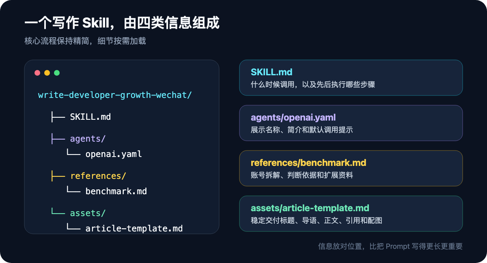

# 发布信息

## 推荐标题

我把公众号写作做成了一个 Skill：这篇文章就是第一次实战

## 备选标题

1. 我用 Codex 做了一个公众号写作 Skill，它真的能替我写吗？
2. 公众号写作最耗时间的，可能根本不是写字
3. 写了两篇公众号之后，我决定不再每次从零开始
4. 让 AI 写公众号之前，我先给它做了一套工作说明书

## 封面


## 导语

写公众号最耗时间的，往往不是写字，而是每次都要重新做选题、查资料、定标题、搭结构和检查发布物。

我把这些重复步骤做成了一个 Codex Skill。

而你现在看到的这篇文章，就是它的第一次完整实战。

---

这篇文章有点绕。

它讲的是，我怎样把公众号写作做成一个 Skill；同时，它也是这个 Skill 产出的第一篇完整文章。

换句话说，你现在看到的不只是一篇经验总结，还是一次现场验收。

## 写了两篇之后，我发现最累的不是写字

最近我开始认真运营自己的公众号「说点AI」。定位很明确：面向开发者，分享 AI 实战工具、编程提效方法和技术趋势判断。

前两篇文章写下来，我发现每次真正消耗时间的，并不是把句子敲出来，而是反复做下面这些决定：

- 这个选题值不值得写？
- 它和上一篇文章有没有重复？
- 标题是讲概念，还是直接给结果？
- 技术事实从哪里核验？
- 文章怎样从“能看懂”推进到“愿意看完”？
- 发布前还要准备哪些摘要、配图和排版稿？

这些问题，每篇都要回答一次。

如果每次都从零给 AI 解释，相当于我虽然请了一个助手，却还要每天重新做一遍入职培训。

所以我换了个思路：把稳定的方法写进一个 Skill，让 AI 在开始写作前，先按这套工作流做事。


## Skill 不是一条更长的 Prompt

Prompt 通常解决的是一次任务。

比如：

> 帮我写一篇面向程序员的公众号文章，语气自然一点，标题要有吸引力。

它当然能用，但下次还得重新描述。文章结构、事实核验、文件命名、配图位置，往往也要继续补充。

Skill 更像一份可以反复调用的工作说明书。除了核心指令，还能带上参考资料、模板和脚本。

OpenAI 的 Codex 文档把 Skill 定义为一种可复用的工作流：系统平时只读取 Skill 的名称和描述，判断任务匹配后，再加载完整的 `SKILL.md`。这叫渐进式加载，既保留上下文，又能让一套方法随时被调用。

一个最小的 Skill，其实只需要一个目录和一份 `SKILL.md`。需要时，再逐步加入脚本、参考资料和模板。

我这次做的公众号写作 Skill，就放在当前内容仓库的 `.agents/skills/` 下。它只服务于这个公众号项目，不影响其他工作区。

## 我没有复制文章，而是拆解内容机制

我的参考对象是「程序员成长指北」。

模仿一个账号，最容易走偏的方式，是学它的句式、标题口头禅，甚至直接改写它的文章。

真正值得学习的是背后的机制：

- 它通常选择什么样的问题？
- 标题如何承诺一个明确结果？
- 开头怎样快速建立阅读理由？
- 技术内容靠什么证据站住？
- 文章最后如何自然地引导关注？

我把这些可复用的部分整理成参考资料，再把适合「说点AI」的规则写进 Skill。

这里有个边界：借鉴内容机制，不照搬原文表达。

账号最终能被记住，靠的不是“像谁”，而是读者逐渐知道：遇到某一类问题，可以来这里找答案。

## 这个 Skill 里面到底有什么

目前的真实目录只有四个核心文件：

```text
.agents/skills/write-developer-growth-wechat/
├── SKILL.md
├── agents/openai.yaml
├── references/benchmark.md
└── assets/article-template.md
```



`SKILL.md` 规定执行顺序；`benchmark.md` 保存拆解后的参考机制；`article-template.md` 固定标题、导语、正文、参考资料和图片位置；`openai.yaml` 则让这套 Skill 更容易被找到和调用。

这套结构的目的不是显得复杂，而是让不同信息待在合适的位置。每次写作只加载当前需要的内容，不必把所有背景资料都塞进一条 Prompt。

## 我给它加了三个关键约束

工作流如果只有步骤，很容易稳定地产出平庸内容。

所以，我又加了三个约束。

### 1. 选题先打分，低于 3.5 分不进入写作

评分维度包括读者痛点、时效性、原创增量、证据强度和系列价值。

其中，原创增量和证据强度权重最高。

一个话题即使很热，如果只能重新讲一遍公开信息，也不值得急着写。

评分不能预测爆款，但可以减少“写完才发现没东西”的概率。

### 2. 技术文章必须留下证据

涉及 API、产品能力、版本差异和行为判断时，优先查官方文档和一手资料。

如果是教程，至少要有可运行的代码、真实输出、错误复现或清晰的验证步骤。

“听说可以”和“我验证过可以”，读起来可能只差几个字，可信度却完全不同。

### 3. 发布前必须过质量门

文章完成后，还要检查标题是否兑现正文、开头是否进入问题太慢、强结论有没有来源、代码能否执行、段落是否适合手机阅读，以及结尾是否只剩一句生硬的“欢迎关注”。

这一步不酷，却能拦住不少低级问题。

## 这篇文章是怎么被它写出来的

为了避免只讲理论，我直接用这个 Skill 处理了本文。

它先读取公众号仓库的规则，知道每篇文章要放进独立日期目录，并准备正文、摘要、发布版和图片资产。

接着，它检查已有文章，发现我已经写过一篇偏概念的 Skills 介绍。如果继续解释“Skill 是什么”，新文章会和旧内容重复。

于是，选题从“介绍 Skills”收窄为“展示一个真实写作 Skill 的创建过程，并回答 AI 到底能替作者做多少”。

然后，它读取实际存在的 Skill 文件，核对 OpenAI 官方文档，整理标题候选，搭建正文结构，生成高分辨率 PNG 配图，最后把文件打包到同一个文章目录。

这套流程最有价值的地方，不是一次生成了多少字，而是把容易遗漏的环节串了起来。

## AI 到底能替我做多少

跑完这一遍，我的答案比“AI 能写文章”更具体。

AI 很适合接手四类工作：

### 重复说明

语言、读者、结构、文件命名、质量标准，不再每次从头交代。

### 资料整理

快速读取旧文章、参考资料和官方文档，找出重复点、事实依据和潜在缺口。

### 结构化生产

从选题简报、标题候选到正文、摘要、发布版和配图清单，这些有明确格式的工作，很适合流程化。

### 机械检查

漏文件、错路径、标题与正文不一致、段落太长、引用缺失，让 AI 查一遍，比作者靠记忆稳得多。


## AI 替代不了的，是作者要为之负责的部分

### 真实经历要自己拥有

AI 可以整理过程，但它不能替我拥有这次过程。如果我没有真的做过这个 Skill，文章里的“实战”就只是包装。

### 方向和取舍要自己判断

评分表可以辅助选题，但公众号下一阶段应该写什么、服务哪类读者、放弃哪些流量，需要作者自己决定。

### 什么像自己，要自己选择

同一个意思有很多种表达。哪一句像自己，哪一段太用力，哪一个标题虽然容易点击却不想发，这些很难完全量化。

### 文章署谁的名字，谁就负责

文章署的是作者的名字。技术结论错了、推荐误导了读者，不能把责任推给模型。

所以，我更愿意把 AI 看成一个执行力很强的编辑助理，而不是代笔人。

## 别急着做一个万能写作系统

如果你也想把自己的工作做成 Skill，不用一开始就设计几十个步骤。

先找出最近一个月里，你至少重复交代过三次的事情。

可能是每次写周报都要重新说明格式，每次做代码审查都要强调同一组检查项，或者每次发布前都要靠脑子记住文件和配图。

把这部分写成最小版 `SKILL.md`，真实跑一次，再补参考资料和模板。

不要先追求完整。一个能减少重复、可以被验证的工作流，已经比一条越来越长的 Prompt 更有价值。

## 这只是第一版

写作 Skill 不是建好就结束了。

真正的反馈要等文章发出去之后才会出现：标题有没有人点、哪些段落被转发、读者在哪一段离开、什么问题在留言区反复出现。

这些数据会决定下一版 Skill 应该改什么。

这篇文章完成了第一次闭环：我用一套写作工作流，写了一篇介绍这套工作流的文章。

它还不能证明这套方法能做出爆款，但至少证明了一件事：公众号写作中那些反复、机械、容易遗漏的部分，已经可以交给 AI；而作者更应该把时间留给真实经验、判断和表达。

如果你也在用 AI 做内容，欢迎告诉我：你最想从哪一个重复环节开始自动化？

---

## 参考资料

1. [OpenAI Codex Manual：Build skills](https://learn.chatgpt.com/docs/build-skills)
2. [OpenAI Codex Manual](https://developers.openai.com/codex/codex-manual.md)

## AI 辅助说明

本文由作者确定公众号方向、选择参考对象并确认选题；Codex 用于资料核验、结构整理、初稿生成、配图制作和文件检查，最终内容由作者审校后发布。
